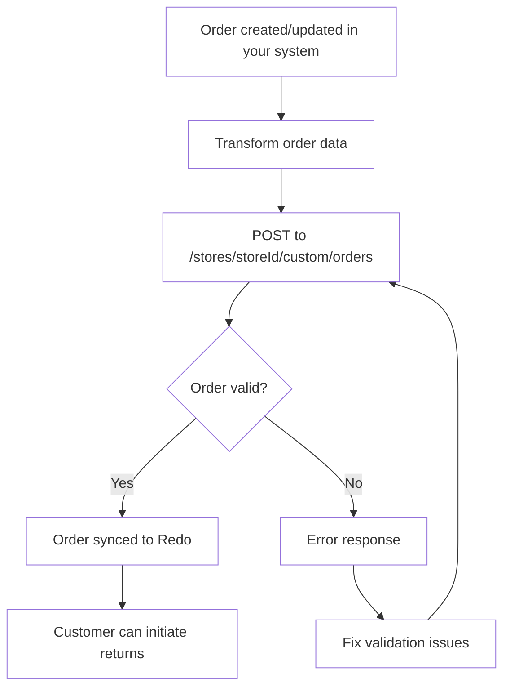

## Overview

This guide helps you integrate your custom e-commerce platform or order
management system with Redo by syncing orders through our dedicated orders
endpoint. This integration allows you to programmatically send order data to
Redo, enabling seamless returns and package protection for your customers.

## When to Use This Integration

Use the custom integration orders endpoint when:

- You have a custom-built e-commerce platform
- Your platform isn't directly supported by Redo
- You need programmatic control over order synchronization
- You're building a middleware integration between your systems

## Integration Flow



## Endpoint

Send order data to the following endpoint:

```
POST https://api.getredo.com/v2.2/stores/{storeId}/custom/orders
```

| Parameter | Description |
|-----------|-------------|
| `storeId` | Your store ID, found in **Settings** → **Developer** in the Redo Dashboard |

For the full request and response schema, see
[Sync Custom Order](/api-reference/returns-custom-integration/sync-custom-order)
in the API reference.

### Headers

```
Authorization: Bearer YOUR_API_SECRET
Content-Type: application/json
```

### Response

A successful request returns:

```json
{
  "message": "Order synced successfully",
  "orderId": "your_order_id",
  "redoId": "68b1f0c2a4d1e90012ab34cd"
}
```

| Field | Description |
|-------|-------------|
| `orderId` | The order ID you sent in the request body |
| `redoId` | The Redo order ID for the synced order |

Syncing the same `id` again updates the existing Redo order, so this endpoint is
safe to call on every order create and update.

A validation failure returns a `400` with the offending fields:

```json
{
  "error": "Invalid order payload",
  "errors": { "properties": { "lineItems": { "errors": ["Invalid input"] } } }
}
```

## Order Schema

The orders endpoint accepts order data in the following structure. All fields
must conform to this schema for successful synchronization.

<AccordionGroup>
  <Accordion title="Order Object">
    ```typescript
    {
      id: string;                    // Unique order identifier
      type: "order";                 // Must be literal "order"
      createdAt: string;            // ISO 8601 timestamp
      updatedAt: string;            // ISO 8601 timestamp
      presentmentCurrency: string;  // Currency shown to customer
      shopCurrency: string;         // Your shop's base currency
      tags?: string[];              // Optional order tags
      salesChannel?: string | null; // Sales channel identifier
      customer: {
        id?: string;                // Optional customer identifier
        email: string;              // Required email address
        firstName: string;          // Customer first name
        lastName: string;           // Customer last name
        phone?: string | null;      // Optional phone number
        tags?: string[];            // Optional customer tags
      },
      shippingAddress: {
        address1: string;           // Primary address line
        address2?: string | null;   // Secondary address line
        city: string;               // City name
        company?: string | null;    // Company name
        firstName?: string | null;
        lastName?: string | null;
        provinceCode: string;       // State/province code
        zip: string;                // Postal code
        countryCode: string;        // ISO country code
        phone?: string | null;      // Contact phone
      },
      billingAddress?: {            // Optional, same structure as shippingAddress
        address1?: string;
        address2?: string | null;
        city?: string;
        company?: string | null;
        firstName?: string | null;
        lastName?: string | null;
        provinceCode?: string;
        zip?: string;
        countryCode?: string;
        phone?: string | null;
      },
      lineItems: [/* See Line Items section below */],
      shippingLines: [
        {
          id: string;
          title: string;            // Shipping method name
          code?: string;            // Shipping method code
          priceSet: {               // Pre-tax, pre-discount price
            presentmentMoney: { amount: string, currencyCode: string },
            shopMoney: { amount: string, currencyCode: string }
          },
          discounts?: [/* Same structure as line item discounts */],
          taxLines?: [/* Same structure as line item taxes */]
        }
      ],
      orderDiscounts: [
        {
          discountId: string;
          discountTitle?: string;
          discountCode?: string;
          amountSet: {
            presentmentMoney: { amount: string, currencyCode: string },
            shopMoney: { amount: string, currencyCode: string }
          }
        }
      ],
      fulfillments: [
        {
          id: string;
          shippingDate?: string | null;    // ISO 8601 timestamp
          deliveryDate?: string | null;    // ISO 8601 timestamp
          trackingNumbers?: [
            {
              carrier?: string | null;
              trackingNumber: string;
            }
          ],
          trackingUrls?: string[];
          lineItems: [
            {
              id: string;                  // References line item ID
              quantity: number;            // Fulfilled quantity
            }
          ]
        }
      ],
      transactions?: [
        {
          paymentId: string;
          amount: number;
          currency: string;
          createdDate: string;         // ISO 8601 timestamp
          paymentGateway: string;      // Payment processor name
          additionalDetails?: {        // Required when paymentGateway is "authorize_net"
            creditCardLastFour: string; // Exactly 4 digits
          }
        }
      ]
    }
    ```
  </Accordion>

  <Accordion title="Line Items">
    Each order must include at least one line item:

    ```typescript
    lineItems: [
      {
        id: string;                      // Unique line item ID
        productId: string;               // Product identifier
        variantId?: string | null;       // Variant identifier
        additionalProductId?: string | null;
        sku: string;                     // Stock keeping unit
        title: string;                   // Product title
        variantTitle?: string | null;    // Variant name
        vendor?: string | null;          // Vendor name
        fulfillmentService?: string | null;
        quantity: number;                // Quantity ordered
        returnableQuantity?: number | null; // Qty eligible for return
        priceSet: {                      // Pre-tax, pre-discount price
          presentmentMoney: {
            amount: string;
            currencyCode: string;
          },
          shopMoney: {
            amount: string;
            currencyCode: string;
          }
        },
        weight?: {
          value: number;               // Grams
          unit: string;                // Label only; value is read as grams
        } | null,
        image?: string | null;           // Primary image URL — the one Redo displays
        images?: [                       // Accepted, but not currently displayed
          {
            url: string;
            data?: string | null;        // Base64 image data
          }
        ],
        properties?: [                   // Custom properties
          {
            name: string;
            value: string;
          }
        ],
        tags?: string[];
        discounts?: [                    // Line item discounts
          {
            discountId: string;
            discountTitle?: string;
            discountCode?: string;
            amountSet: {
              presentmentMoney: { amount: string, currencyCode: string },
              shopMoney: { amount: string, currencyCode: string }
            }
          }
        ],
        taxLines?: [                     // Line item taxes
          {
            title?: string;
            rate: string | null;
            priceSet: {
              presentmentMoney: { amount: string, currencyCode: string },
              shopMoney: { amount: string, currencyCode: string }
            }
          }
        ]
      }
    ]
    ```

  </Accordion>
</AccordionGroup>

## Important Notes

### Money Values

- Use string values for amounts to avoid floating-point precision issues
- Currency codes should follow ISO 4217 standards

### Line Item IDs

- `id` must be unique within an order — duplicate IDs are rejected with a `400`
- Fulfillment `lineItems[].id` must reference a line item `id` on the same order

### Quantities

- `quantity`: Total quantity ordered
- `returnableQuantity`: Quantity eligible for return (may differ from quantity
  for partially fulfilled orders)
- Discount and tax amounts should account for quantity

### Tax and Discount Calculation

- Line item `taxLines` should reflect the total tax for all units (quantity ×
  per-unit tax)
- Line item `discounts` should reflect the total discount for all units
- Shipping `taxLines` and `discounts` follow the same pattern

## Additional Considerations

<Accordion title="Redo Protection Line Items">
  <Note>
  When a customer has purchased Redo protection (returns, package protection, or both), you **must** include a special line item with these exact values:
  </Note>

```typescript
{
  id: string,                    // Unique ID for this line item
  vendor: "re:do",              // Exactly "re:do"
  sku: "x-redo",                // Exactly "x-redo"
  priceSet: { /* Redo fee amount */ },
  tags: ["returns"],            // One or more: "returns", "package protection", "both"
  properties: [
    {
      name: "_redo_type",
      value: "return"           // "return", "package protection", or "both"
    }
  ],
  // ... other standard line item fields
}
```

</Accordion>

## Example Request

<Accordion title="View Example Request">
  ```json
  {
    "id": "order_123456",
    "type": "order",
    "createdAt": "2025-01-15T10:30:00Z",
    "updatedAt": "2025-01-15T10:30:00Z",
    "presentmentCurrency": "USD",
    "shopCurrency": "USD",
    "salesChannel": "web",
    "tags": ["vip-customer"],
    "customer": {
      "id": "cust_789",
      "email": "customer@example.com",
      "firstName": "Jane",
      "lastName": "Doe",
      "phone": "+1234567890"
    },
    "shippingAddress": {
      "address1": "123 Main St",
      "address2": "Apt 4B",
      "city": "New York",
      "provinceCode": "NY",
      "zip": "10001",
      "countryCode": "US",
      "firstName": "Jane",
      "lastName": "Doe",
      "phone": "+1234567890"
    },
    "lineItems": [
      {
        "id": "line_1",
        "productId": "prod_456",
        "variantId": "var_789",
        "sku": "TEE-BLK-M",
        "title": "Classic T-Shirt",
        "variantTitle": "Black / Medium",
        "vendor": "Acme Apparel",
        "quantity": 2,
        "returnableQuantity": 2,
        "priceSet": {
          "presentmentMoney": {
            "amount": "29.99",
            "currencyCode": "USD"
          },
          "shopMoney": {
            "amount": "29.99",
            "currencyCode": "USD"
          }
        },
        "weight": {
          "value": 227,
          "unit": "g"
        },
        "image": "https://example.com/images/tee.jpg"
      }
    ],
    "shippingLines": [
      {
        "id": "ship_1",
        "title": "Standard Shipping",
        "code": "standard",
        "priceSet": {
          "presentmentMoney": {
            "amount": "5.99",
            "currencyCode": "USD"
          },
          "shopMoney": {
            "amount": "5.99",
            "currencyCode": "USD"
          }
        }
      }
    ],
    "orderDiscounts": [],
    "fulfillments": [],
    "transactions": [
      {
        "paymentId": "pay_abc123",
        "amount": 65.97,
        "currency": "USD",
        "createdDate": "2025-01-15T10:30:00Z",
        "paymentGateway": "stripe"
      }
    ]
  }
  ```
</Accordion>

## Next Steps

<Steps>
  <Step title="Get API Credentials">
    Log in to your [Redo Dashboard](https://app.getredo.com), go to **Settings** → **Developer**, and click **Add API Client** to generate your API secret. See [Authentication](/docs/api-reference/authentication) for details.
  </Step>
  <Step title="Map Your Order Data">
    Transform your order data to match the required schema
  </Step>
  <Step title="Implement the Integration">
    Build your integration to POST orders to `https://api.getredo.com/v2.2/stores/{storeId}/custom/orders` when created or
    updated
  </Step>
  <Step title="Test Thoroughly">
    Validate your integration with test orders before going live
  </Step>
</Steps>

## Need Help?

If you have questions about implementing this integration or need assistance
with schema validation, contact our support team at
[support@getredo.com](mailto:support@getredo.com) or check
[Sync Custom Order](/api-reference/returns-custom-integration/sync-custom-order)
and the rest of the [API Reference](/docs/api-reference/introduction) for
additional endpoint documentation.
