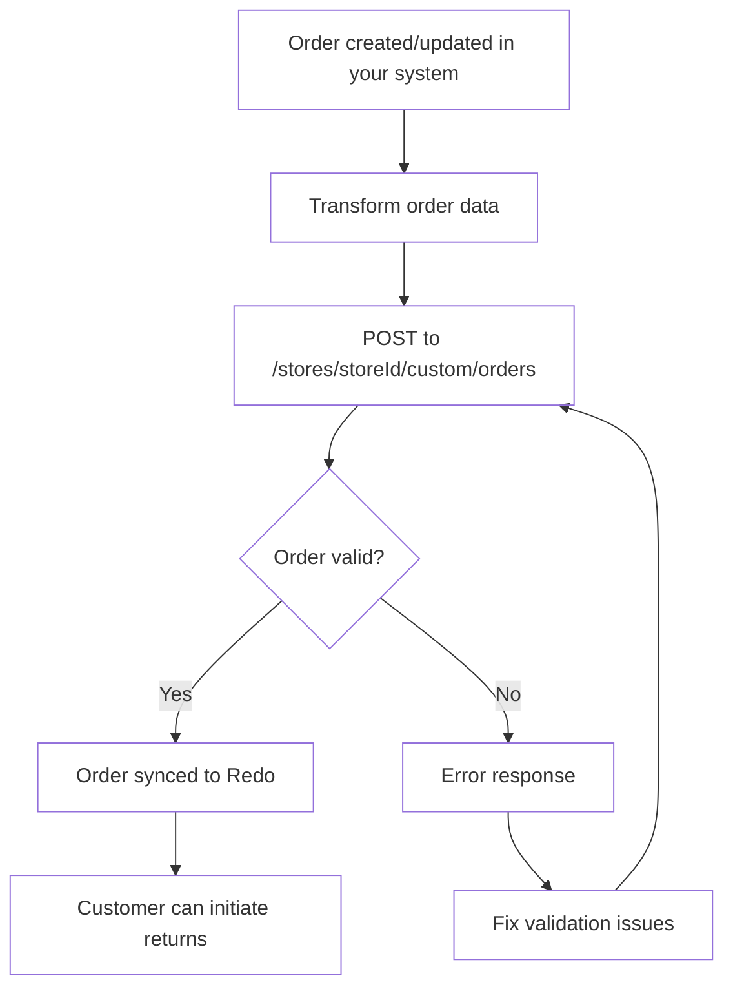

## Overview

This guide helps you integrate your custom e-commerce platform or order
management system with Redo by syncing orders through our dedicated orders
endpoint. This integration allows you to programmatically send order data to
Redo, enabling seamless returns and package protection for your customers.

Synced orders also feed Redo order tracking. Once you send a fulfillment with
tracking numbers, Redo tracks the shipment and sends tracking notifications
according to your Redo settings.

## When to Use This Integration

Use the custom integration orders endpoint when:

- You have a custom-built e-commerce platform
- Your platform isn't directly supported by Redo
- You need programmatic control over order synchronization
- You're building a middleware integration between your systems

## Integration flow



## The endpoint

```
POST https://api.getredo.com/v2.2/stores/{storeId}/custom/orders
```

Your `storeId` is in **Settings → Developer** in the Redo Dashboard, where you
also generate the API secret. See
[Authentication](/docs/api-reference/authentication) for how to send it.

The full request and response schema, every field, and a complete example
payload live in
[Sync Custom Order](/api-reference/returns-custom-integration/sync-custom-order).

Syncing the same order `id` again updates the existing Redo order, so the
endpoint is safe to call on every order create and update.

## Getting the values right

### Line item IDs

`id` identifies one line on one order, not a product. Use `productId` and `sku`
for product identity — those are meant to repeat across orders.

- Unique **within** an order — duplicates are rejected with a `400`
- **Stable across re-syncs** — returns reference it, so regenerating IDs orphans
  existing returns
- Not reused across orders
- No underscores

A per-order counter such as `ORD1234-1`, `ORD1234-2` satisfies all of these.

### Money

Send amounts as strings to avoid floating-point drift, and currency codes as
ISO 4217. Line item `priceSet` is **pre-tax and pre-discount**.

### Quantities, taxes and discounts

`quantity` is the amount ordered; `returnableQuantity` is how much is eligible
for return, which may be lower. Line item `taxLines` and `discounts` are totals
for **all units** on the line — quantity × per-unit — not per-unit values.
Shipping lines follow the same rule.

### Fulfillments

Fulfillments are what make items returnable. Unless your Redo settings allow
returns on unfulfilled items, a line with no fulfillment never appears in the
return portal. Send a fulfillment once the order ships, and include
`deliveryDate` if your return window should start at delivery rather than at
order creation.

Include `trackingNumbers` and `trackingUrls` on the fulfillment — those drive
order tracking and tracking notifications.

Shipping lines do not affect what is returnable.

## Coverage

### The Redo coverage line item

When a shopper has purchased Redo protection — returns, package protection, or
both — you **must** include a line item with these exact values:

```typescript
{
  id: string,                    // Unique ID for this line item
  vendor: "re:do",              // Exactly "re:do"
  sku: "x-redo",                // Exactly "x-redo"
  priceSet: { /* Full coverage price paid */ },
  tags: ["returns"],            // One or more: "returns", "package protection", "both"
  properties: [
    {
      name: "_redo_type",
      value: "returns"          // "returns", "package protection", "both", or "final sale"
    }
  ],
  // ... other standard line item fields
}
```

Send **one** coverage line item per order. When the shopper bought more than one
kind of coverage, use `"both"` (or a comma-separated value such as
`"returns,package protection"`) and set `priceSet` to the combined total. If you
send separate line items instead, each one must carry only the amount the
shopper paid for that coverage — Redo bills each item on its own.

`priceSet` must be the **full** amount the shopper paid for coverage.

If both are sent, `_redo_type` wins over `tags` — the tags are ignored entirely,
not merged. Keep them in sync.

Values are matched case-insensitively, and spaces, underscores, and hyphens are
interchangeable, so `"Package_Protection"` and `"package protection"` are the
same value. A value Redo does not recognize is treated as returns coverage, so
send a recognized value or omit `_redo_type` rather than passing a placeholder.

### Final sale

When the shopper buys final sale returns coverage, mark it alongside `returns`:

```typescript
tags: ["returns", "final sale"]
// or
properties: [{ name: "_redo_type", value: "returns,final sale" }]
// or, alongside any coverage value
properties: [
  { name: "_redo_type", value: "returns" },
  { name: "__final_sale_coverage", value: "true" }
]
```

Final sale coverage always implies returns coverage. Without one of these
signals, final sale applies only when your Redo settings cover every order or
treat every Redo purchase as final sale. Final sale coverage also requires
final sale returns to be enabled for the order's shipping country.

### Package Protection Plus

- **Shopper-paid** — include the coverage line item with
  `_redo_type: "package protection"` (or `"both"`), priced at what the shopper
  paid.
- **Merchant-paid or all orders covered** — send no coverage line item. Redo
  applies it based on your Redo settings.

## Next steps

<Steps>
  <Step title="Get API credentials">
    In the [Redo Dashboard](https://app.getredo.com), go to **Settings → Developer** and click **Add API Client**.
  </Step>
  <Step title="Map your orders">
    Follow [Sync Custom Order](/api-reference/returns-custom-integration/sync-custom-order) for the field-by-field schema.
  </Step>
  <Step title="Send test orders">
    Validate with test orders, including one with a coverage line item, before going live.
  </Step>
</Steps>

## Need help?

Contact [support@getredo.com](mailto:support@getredo.com), or see the
[API Reference](/docs/api-reference/introduction).
