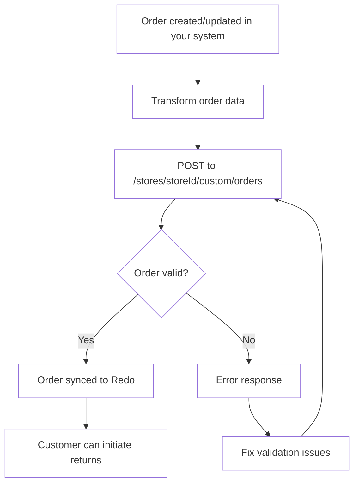

## Overview

This guide helps you integrate your custom e-commerce platform or order
management system with Redo by syncing orders through our dedicated orders
endpoint. This integration allows you to programmatically send order data to
Redo, enabling seamless returns and package protection for your customers.

## When to Use This Integration

Use the custom integration orders endpoint when:

- You have a custom-built e-commerce platform
- Your platform isn't directly supported by Redo
- You need programmatic control over order synchronization
- You're building a middleware integration between your systems

## Integration Flow



## The endpoint

```
POST https://api.getredo.com/v2.2/stores/{storeId}/custom/orders
```

Your `storeId` is in **Settings → Developer** in the Redo Dashboard, where you
also generate the API secret. See
[Authentication](/docs/api-reference/authentication) for how to send it.

**The full request and response schema, every field, and a complete example
payload live in
[Sync Custom Order](/api-reference/returns-custom-integration/sync-custom-order).**
This guide covers the parts the schema cannot tell you: what to put in the
fields, and how Redo interprets them.

Syncing the same order `id` again updates the existing Redo order, so the
endpoint is safe to call on every order create and update.

## Getting the values right

### Line item IDs

`id` identifies one line on one order, not a product.

- It must be unique **within** an order — duplicates are rejected with a `400`
- It must be **stable for that order** across re-syncs. Returns reference it, so
  regenerating IDs on every sync orphans existing returns
- Do **not** reuse the same `id` across orders for the same product. Some
  lookups match on line item ID across a store's orders and will pull in
  unrelated orders
- Avoid underscores. `id` is combined with an index internally using `_` as the
  separator, so an underscore in the ID does not round-trip

A per-order counter such as `ORD1234-1`, `ORD1234-2` satisfies all of these.
Cross-order product identity belongs in `productId` and `sku`, which are meant
to repeat.

### Money

Send amounts as strings to avoid floating-point drift, and currency codes as
ISO 4217. Line item `priceSet` is **pre-tax and pre-discount**.

### Quantities, taxes and discounts

`quantity` is the amount ordered; `returnableQuantity` is how much is eligible
for return, which may be lower. Line item `taxLines` and `discounts` are totals
for **all units** on the line — quantity × per-unit — not per-unit values.
Shipping lines follow the same rule.

### Fulfillments

Fulfillments are what make items returnable. Unless your Redo settings allow
returns on unfulfilled items, a line with no fulfillment never appears in the
return portal. Send a fulfillment once the order ships, and include
`deliveryDate` if your return window should start at delivery rather than at
order creation.

Shipping lines are separate — they carry what the shopper paid for shipping and
do not affect what is returnable.

## Coverage

### The Redo coverage line item

When a shopper has purchased Redo protection — returns, package protection, or
both — you **must** include a line item with these exact values:

```typescript
{
  id: string,                    // Unique ID for this line item
  vendor: "re:do",              // Exactly "re:do"
  sku: "x-redo",                // Exactly "x-redo"
  priceSet: { /* Full coverage price paid */ },
  tags: ["returns"],            // One or more: "returns", "package protection", "both"
  properties: [
    {
      name: "_redo_type",
      value: "returns"          // "returns", "package protection", or "both"
    }
  ],
  // ... other standard line item fields
}
```

`priceSet` must be the **full** price of the coverage item — the entire amount
the shopper paid for it, before any splits or deductions. When one line item
covers more than one type of coverage, send the combined total.

When `_redo_type` is present it takes precedence over `tags`. Send one or the
other consistently; sending a `_redo_type` that covers less than the tags do
will under-report the coverage purchased.

### Final sale

Final sale returns coverage is billed separately from base returns coverage, so
the payload has to say when the shopper bought it. Add `final sale` alongside
`returns`:

```typescript
tags: ["returns", "final sale"]
// or
properties: [{ name: "_redo_type", value: "returns,final sale" }]
```

An explicit property is also accepted, and wins on its own:

```typescript
properties: [
  { name: "_redo_type", value: "returns" },
  { name: "__final_sale_coverage", value: "true" }
]
```

Any of these marks the order as final-sale covered **and** as returns covered —
final sale coverage always implies returns coverage. Without one of them, final
sale is only applied when your Redo settings cover every order or mark all Redo
purchases as final sale.

### Package Protection Plus

Package Protection Plus is configured in your Redo settings, not on the order
payload.

- **Shopper-paid** — include the Redo line item above with
  `_redo_type: "package protection"` (or `"both"`), priced at what the shopper
  paid.
- **Merchant-paid per order** or **all orders covered** — send no Redo line
  item. Redo applies coverage to every order that falls inside the enabled date
  range and whose items are not excluded by your protection exclusion tags or
  collections.

## Next steps

<Steps>
  <Step title="Get API credentials">
    In the [Redo Dashboard](https://app.getredo.com), go to **Settings → Developer** and click **Add API Client**.
  </Step>
  <Step title="Map your orders">
    Follow [Sync Custom Order](/api-reference/returns-custom-integration/sync-custom-order) for the field-by-field schema.
  </Step>
  <Step title="Send test orders">
    Validate with test orders, including one with a coverage line item, before going live.
  </Step>
</Steps>

## Need help?

Contact [support@getredo.com](mailto:support@getredo.com), or see the
[API Reference](/docs/api-reference/introduction).
