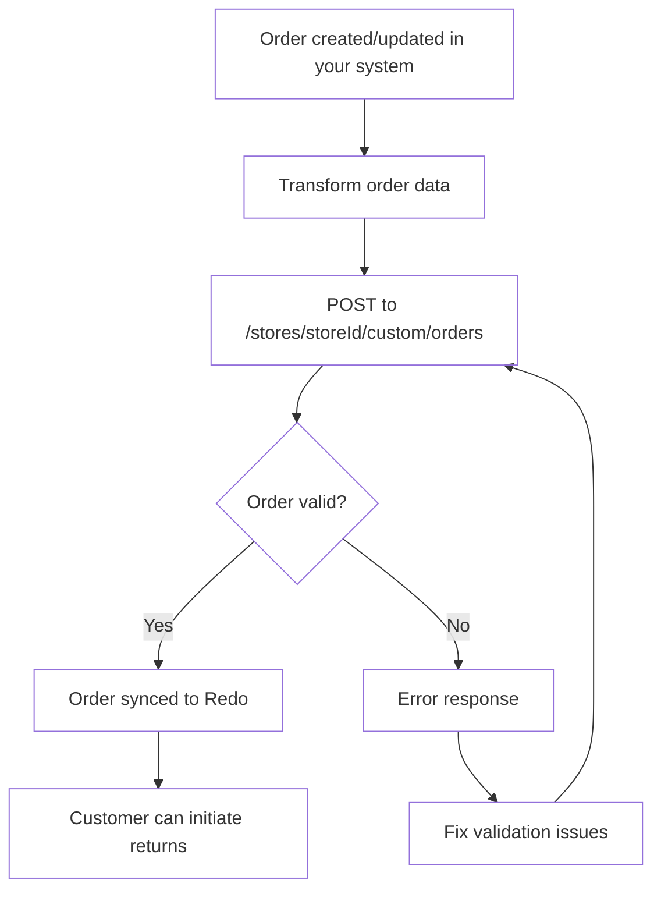

## Overview

Sync orders from a custom e-commerce platform, an unsupported platform, or your
own middleware into Redo, so your customers get returns and package protection.

## Integration flow



## The endpoint

```
POST https://api.getredo.com/v2.2/stores/{storeId}/custom/orders
```

Your `storeId` is in **Settings → Developer** in the Redo Dashboard, where you
also generate the API secret. See
[Authentication](/docs/api-reference/authentication) for how to send it.

The full request and response schema, every field, and a complete example
payload live in
[Sync Custom Order](/api-reference/returns-custom-integration/sync-custom-order).

Syncing the same order `id` again updates the existing Redo order, so the
endpoint is safe to call on every order create and update.

## Getting the values right

### Line item IDs

`id` identifies one line on one order, not a product. Use `productId` and `sku`
for product identity — those are meant to repeat across orders.

- Unique **within** an order — duplicates are rejected with a `400`
- **Stable across re-syncs** — returns reference it, so regenerating IDs orphans
  existing returns
- Not reused across orders
- No underscores

A per-order counter such as `ORD1234-1`, `ORD1234-2` satisfies all of these.

### Money

Send amounts as strings to avoid floating-point drift, and currency codes as
ISO 4217. Line item `priceSet` is **pre-tax and pre-discount**.

### Quantities, taxes and discounts

`quantity` is the amount ordered; `returnableQuantity` is how much is eligible
for return, which may be lower. Line item `taxLines` and `discounts` are totals
for **all units** on the line — quantity × per-unit — not per-unit values.
Shipping lines follow the same rule.

### Fulfillments

Fulfillments are what make items returnable. Unless your Redo settings allow
returns on unfulfilled items, a line with no fulfillment never appears in the
return portal. Send a fulfillment once the order ships, and include
`deliveryDate` if your return window should start at delivery rather than at
order creation.

Shipping lines do not affect what is returnable.

## Coverage

### The Redo coverage line item

When a shopper has purchased Redo protection — returns, package protection, or
both — you **must** include a line item with these exact values:

```typescript
{
  id: string,                    // Unique ID for this line item
  vendor: "re:do",              // Exactly "re:do"
  sku: "x-redo",                // Exactly "x-redo"
  priceSet: { /* Full coverage price paid */ },
  tags: ["returns"],            // One or more: "returns", "package protection", "both"
  properties: [
    {
      name: "_redo_type",
      value: "returns"          // "returns", "package protection", or "both"
    }
  ],
  // ... other standard line item fields
}
```

`priceSet` must be the **full** amount the shopper paid for coverage. When one
line item covers more than one type, send the combined total.

If both are sent, `_redo_type` wins over `tags`. Keep them in sync.

### Final sale

When the shopper buys final sale returns coverage, mark it alongside `returns`:

```typescript
tags: ["returns", "final sale"]
// or
properties: [{ name: "_redo_type", value: "returns,final sale" }]
```

Final sale coverage always implies returns coverage. Without this, final sale
only applies if your Redo settings cover every order.

### Package Protection Plus

- **Shopper-paid** — include the coverage line item with
  `_redo_type: "package protection"` (or `"both"`), priced at what the shopper
  paid.
- **Merchant-paid or all orders covered** — send no coverage line item. Redo
  applies it based on your Redo settings.

## Next steps

<Steps>
  <Step title="Get API credentials">
    In the [Redo Dashboard](https://app.getredo.com), go to **Settings → Developer** and click **Add API Client**.
  </Step>
  <Step title="Map your orders">
    Follow [Sync Custom Order](/api-reference/returns-custom-integration/sync-custom-order) for the field-by-field schema.
  </Step>
  <Step title="Send test orders">
    Validate with test orders, including one with a coverage line item, before going live.
  </Step>
</Steps>

## Need help?

Contact [support@getredo.com](mailto:support@getredo.com), or see the
[API Reference](/docs/api-reference/introduction).
