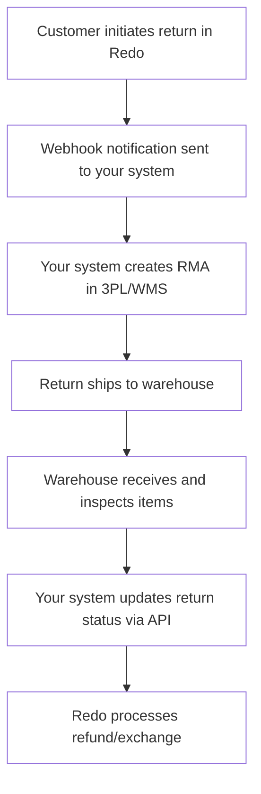

## Overview

If you're building a custom integration between your third-party logistics (3PL) provider, warehouse management system (WMS), or other external system and Redo, this guide will help you understand how to leverage our APIs to create seamless return workflows.

## Choosing the Right API

Before building your integration, determine which Redo API best fits your needs:

<CardGroup cols={2}>
  <Card
    title="Loop-Compatible API"
    icon="arrows-rotate"
    href="/docs/api-reference/loop-compatible-api"
  >
    **Use this if:** You already have a Loop Returns integration built

    Minimal redevelopment work required - simply change the base URL from Loop to Redo and your integration continues working.
  </Card>

  <Card
    title="Redo Native API"
    icon="bolt"
    href="/docs/api-reference/introduction"
  >
    **Use this if:** You're building a new integration from scratch

    Full access to all Redo features with comprehensive endpoint documentation.
  </Card>
</CardGroup>

## What You Can Build

Redo's APIs enable you to create powerful integrations that automate your return workflows. Here are the core capabilities:

### Returns Management

Create, retrieve, update, and manage returns throughout their lifecycle. You can:

- Fetch return details including items, customer information, and status
- Update return statuses as they progress through your warehouse
- Add comments and notes to returns for internal tracking
- Process returns to trigger refunds or exchanges

**Key Endpoints:**
- [List Returns](/docs/api-reference/introduction#endpoints) - `GET /stores/{storeId}/returns`
- [Update Return Status](/docs/api-reference/introduction#endpoints) - `POST /returns/{returnId}/status`

### Return Shipping

Generate return shipping labels and track return shipments:

- Get shipping rates for return shipments
- Purchase return shipping labels programmatically
- Retrieve shipping label documents
- Track return shipments back to your warehouse

**Key Endpoints:**
- [Shipping Rates](/docs/api-reference/introduction#endpoints) - `POST /stores/{storeId}/shipments/rates`
- [Purchase Label](/docs/api-reference/introduction#endpoints) - `POST /stores/{storeId}/shipments/buy`

### Invoicing

Access invoice data for returns processing:

- Retrieve invoices for completed returns
- Export invoice line items for accounting systems
- Track invoice status and payment details

**Key Endpoints:**
- [List Invoices](/docs/api-reference/introduction#endpoints) - `GET /stores/{storeId}/invoices`

### Webhooks

Set up real-time notifications for return events:

- Subscribe to return status changes
- Receive notifications when returns are initiated
- Get alerts for refund processing completion
- Monitor shipment tracking updates

**Key Endpoints:**
- [Create Webhook](/docs/api-reference/introduction#endpoints) - `POST /stores/{storeId}/webhooks`
- [List Webhooks](/docs/api-reference/introduction#endpoints) - `GET /stores/{storeId}/webhooks`

<Card
  title="Webhooks Guide"
  icon="webhook"
  href="/docs/guides/integrations/webhooks"
>
  Learn more about setting up webhooks for real-time event notifications
</Card>

## Typical Integration Flow

Most 3PL/WMS integrations follow this pattern:

## Implementation Steps

<Steps>
  <Step title="Set Up Authentication">
    Get your API credentials from [support@getredo.com](mailto:support@getredo.com) and implement authentication in your integration

    <Card
      title="Authentication Guide"
      icon="key"
      href="/docs/api-reference/authentication"
    >
      Learn how to authenticate API requests
    </Card>
  </Step>

  <Step title="Subscribe to Webhooks">
    Configure webhooks to receive real-time notifications when returns are created or updated
  </Step>

  <Step title="Handle Return Creation">
    When a webhook notifies you of a new return, fetch the return details and create an RMA in your 3PL/WMS system
  </Step>

  <Step title="Update Return Status">
    As returns progress through your warehouse (received, inspected, restocked), update the return status in Redo
  </Step>

  <Step title="Trigger Processing">
    Once inspection is complete, use the process endpoint to trigger refunds or exchanges
  </Step>
</Steps>

## Testing Your Integration

Before going live, thoroughly test your integration:

1. **Test in a sandbox environment** - Ask support about sandbox/test store access
2. **Create test returns** - Verify your system correctly receives and processes webhooks
3. **Test status updates** - Ensure status changes flow properly between systems
4. **Verify error handling** - Test how your integration handles API errors and timeouts
5. **Load testing** - Confirm your integration can handle your expected return volume

## Rate Limits and Best Practices

<Warning>
  API rate limits apply to all endpoints. Contact support for specific rate limit details for your account.
</Warning>

**Best Practices:**
- Implement exponential backoff for retries on failed requests
- Cache frequently accessed data to reduce API calls
- Use webhooks instead of polling for real-time updates
- Batch operations when possible to minimize API requests
- Log all API interactions for debugging and audit purposes

## Next Steps

<CardGroup cols={2}>
  <Card
    title="API Reference"
    icon="book"
    href="/docs/api-reference/introduction"
  >
    Explore all available endpoints with detailed documentation
  </Card>

  <Card
    title="Webhooks Guide"
    icon="webhook"
    href="/docs/guides/integrations/webhooks"
  >
    Set up real-time notifications for return events
  </Card>

  <Card
    title="Authentication"
    icon="key"
    href="/docs/api-reference/authentication"
  >
    Learn how to authenticate your API requests
  </Card>

  <Card
    title="Error Handling"
    icon="triangle-exclamation"
    href="/docs/api-reference/errors"
  >
    Understand API errors and how to handle them
  </Card>
</CardGroup>

## Need Help?

Building a custom integration? Our team is here to help:

- **Email:** [support@getredo.com](mailto:support@getredo.com)
- **Technical Questions:** Reach out for guidance on API implementation
- **API Credentials:** Contact us to receive your API keys and sandbox access

We can also discuss your specific integration requirements and provide architectural guidance for complex workflows.
