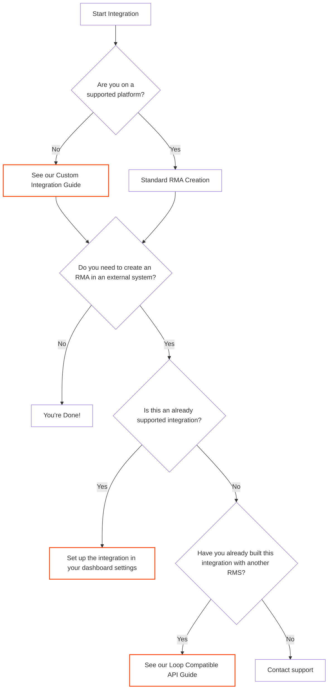

## Overview

This guide helps you determine the best approach for integrating Redo with your
warehouse management system (WMS), third-party logistics provider (3PL), or
other external systems.

## Integration Decision Flow

Follow this flowchart to determine your integration path:

## Integration Paths Explained

### Custom Integration

If you're not using a supported platform like Shopify, CommentSold, or
BigCommerce, you can use our Custom Integration API to sync orders
programmatically.

<Card
  title="Custom Integration Guide"
  icon="code"
  href="/docs/integrations/custom-integration"
>
  Learn how to sync orders to Redo using our custom orders endpoint
</Card>

### Supported Integrations

Redo offers pre-built integrations with popular WMS and 3PL providers. Check
below to see if your system is supported. Setup will require you to get an api
key and other details from your provider, but typically takes just a few clicks.

<AccordionGroup>
  <Accordion title="View All Supported Integrations">
    - **AIMS360** – Fashion ERP platform

    - **ApparelMagic** – Apparel ERP software

    - **Bergen (CloudX)** – Warehouse management system

    - **BlueBox** – Fulfillment services

    - **Brightpearl** – Retail operations suite

    - **Cirro** – Global fulfillment network

    - **Deposco** – Cloud WMS/OMS

    - **Flexport** – Global logistics platform

    - **NetSuite** – Cloud ERP suite

    - **Nimble** – Automated fulfillment

    - **ShipBob** – E-commerce fulfillment

    - **ShipHero** – Warehouse software

    - **ShipMonk** – 3PL fulfillment

    - **ShipStream** – Fulfillment management

    - **Whiplash (Ryder)** – Omnichannel fulfillment

  </Accordion>
</AccordionGroup>

### Loop Compatible API

If you've previously built an integration with Loop Returns or another RMS, Redo
provides compatibility endpoints to minimize redevelopment work.

<Card
  title="Loop Compatible API"
  icon="arrows-rotate"
  href="/docs/api-reference/loop-compatible-api"
>
  Use familiar endpoints to migrate your existing integrations
</Card>

## Next Steps

<Steps>
  <Step title="Identify Your Platform">
    Determine if your e-commerce platform is supported by Redo
  </Step>
  <Step title="Review External Systems">
    Determine if your external management system has an integration already
  </Step>
  <Step title="Choose Your Path">
    Use the flowchart above to select the appropriate guide
  </Step>
</Steps>

## Need Help?

If you're unsure which integration path is right for you, contact our support
team at [support@getredo.com](mailto:support@getredo.com) or check our
[API Reference](/docs/api-reference/introduction) for detailed endpoint
documentation.
